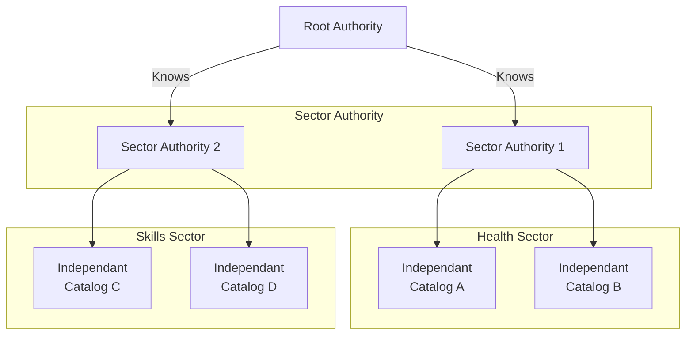

# DSIF PoC \- Federated Catalogue "DNS" (DCAT-first)

*dsif-poc-v0.2*

Goal: a minimal, working federation that lets any Independent Catalog (IC) publish DCAT and a tiny search; Sector Authorities (SA) discover and provide synchronization mechanisms with ICs; a Root Authority (RA) bootstraps SAs.

No identity / contracting / consent in this PoC.



## Changelog

*dsif-poc-v0.2*

- Adjust standardized DCAT APIs to take into account the CKAN DCAT extension (already standardized) instead of re-inventing a new standard
- Adjust IC / Manifest / Connection Profiles to include CKAN related content  
- Change SFC to SA (Sector Authority)
- Set Hydra pagination instead of Link rel (preferred regarding CKAN spec)

## 1\) Roles and responsibilities

- Root Authority (RA)  
  - Source of truth for sectors ⇒ SA endpoints.  
  - Read-only for clients; write via config or a simple admin token.  
- Sector Authority (SA)  
  - Registers ICs in its sector; provides discovery services and synchronization mechanisms with ICs.  
  - Enables efficient federated search across ICs within its sector through reference aggregation rather than direct content aggregation.  
  - Optionally proxies cross-sector queries using RA (hop limit).  
- Independent Catalog (IC)  
  - Serves DCAT-AP JSON‑LD using CKAN DCAT extension compatible endpoints and a tiny search endpoint.  
  - Publishes a self-describing Manifest so any SA/IC can query it.

Conformance keywords: MUST, SHOULD, MAY refer to this PoC spec.

## 2\) Common principles

- Catalogs MUST conform to W3C DCAT v3; they SHOULD additionally declare DCAT‑AP when applicable via dct:conformsTo.  
- Neutral "Search" JSON is the interop query surface. MUST be stable; fields are versioned with X-DSIF-Version.  
- Self-description via a "Federation Manifest" and a "Connection Profile".  
- Pagination is required; rate hints and TTLs are advertised; no auth for read APIs.

HTTP headers:

- X-DSIF-Version: 0.1.0 (MUST be returned)  
- Content-Type: application/ld+json (DCAT), application/json (everything else)  
- Cache-Control: public, max-age=TTL (SHOULD, see ttlSeconds fields)  
- Optional rate headers: X-RateLimit-Limit, X-RateLimit-Remaining, X-RateLimit-Reset

Error model: [application/problem+json (RFC 7807\)](https://datatracker.ietf.org/doc/html/rfc7807)

## 3\) API surfaces

### 3.1 Root Authority (RA)

Public:

- GET /sectors  
  - 200 → array of [SectorRecord](#sector-record-json-ld-example)  
- GET /sectors/{sectorName}  
  - 200 → [SectorRecord](#sector-record-json-ld-example); 404 if unknown

sectorName MUST be a lowercase slug matching `^[a-z0-9-]+ $` ; RA is authoritative for uniqueness.

Optional admin (PoC: static API token in header Authorization: Bearer):

- POST /sectors  
  - creating an existing sectorName MUST 409 Conflict.  
- PUT /sectors/{sectorName}  
- DELETE /sectors/{sectorName}

### 3.2 Sector Authority (SA)

Public:

- GET /.well-known/dataspace-catalog.json → Manifest (type=sa)  
- GET /discovery → [ConnectionProfile](#connection-profile-json-ld-example) for ICs (and MAY include known SAs when type="sa" and sector is their own sector)  
- GET /catalog.jsonld?page=\&modified_since=\&profiles=\&q=\&fq= → DCAT-AP JSON‑LD with Hydra pagination  
- GET /dataset/{id}.jsonld → Individual dataset/service DCAT JSON-LD  
- GET /search?q=\&type=\&format=\&publisher=\&keyword=\&page=\&pageSize=\&sort= → [SearchResult](#searchresult)  
- GET /health → { status, version, uptime }

Optional (cross-sector fan-out via RA; PoC hop limit \= 1):

- GET /federate/search?q=\&scope=skills,mobility\&hop=1 → [SearchResult](#searchresult)

Registration (PoC: open or API-key guarded):

- POST /registerCatalog → accepts [ConnectionProfile](#connection-profile-json-ld-example) (IC self-register)  
- DELETE /registerCatalog/{catalogId}

### 3.3 Independent Catalog (IC)

Public:

- GET /.well-known/dataspace-catalog.json → Manifest (type=ic)  
- GET /catalog.jsonld?page=\&modified_since=\&profiles=\&q=\&fq= → DCAT-AP JSON‑LD with Hydra pagination  
- GET /dataset/{id}.jsonld → Individual dataset/service DCAT JSON-LD  
- GET /search?q=\&type=\&format=\&publisher=\&keyword=\&page=\&pageSize=\&sort= → [SearchResult](#searchresult)  
- GET /health → { status, version, uptime }

## 4\) Data shapes

### 4.1 Federation Manifest (served by SA and IC)

MUST be at /.well-known/dataspace-catalog.json. JSON or JSON‑LD; JSON‑LD encouraged.

JSON Schema (v2020-12, abbreviated):

```json
{
	"$id": "https://spec.dsif.example/schemas/manifest-0.1.json",
	"type": "object",
	"required": ["catalogId", "dsif", "dcat", "endpoints", "capabilities"],
	"properties": {
		"catalogId": { "type": "string" },
		"title": { "type": "string" },
		"description": { "type": "string" },
		"sector": { "type": "string" },
		"type": { "type": "string", "enum": ["sa", "ic"] },
		"version": { "type": "string" },
		"dcat": {
			"type": "object",
			"properties": {
				"conformsTo": {
					"type": "array",
					"items": { "type": "string", "format": "uri" },
					"minItems": 1
				}
			},
			"required": ["conformsTo"]
		},
		"dsif": {
			"type": "object",
			"properties": {
				"version": { "const": "0.1.0" },
				"ttlSeconds": { "type": "integer", "minimum": 60 }
			},
			"required": ["version", "ttlSeconds"]
		},
		"endpoints": {
			"type": "object",
			"required": ["catalog", "search", "health"],
			"properties": {
				"catalog": { "type": "string", "format": "uri" },
				"dataset": { "type": "string", "format": "uri-template" },
				"search": { "type": "string", "format": "uri" },
				"health": { "type": "string", "format": "uri" },
				"discovery": { "type": "string", "format": "uri" },
				"dspCatalog": { "type": "string", "format": "uri" }
			}
		},
		"capabilities": {
			"type": "object",
			"properties": {
				"search": {
					"type": "object",
					"properties": {
						"q": { "type": "boolean" },
						"filters": { "type": "array", "items": { "type": "string" } },
						"paging": { "type": "boolean" },
						"sort": { "type": "array", "items": { "type": "string" } }
					}
				},
				"catalog": {
					"type": "object",
					"properties": {
						"pagination": { "type": "boolean" },
						"format": { "type": "string", "const": "application/ld+json" }
					}
				},
				"auth": {
					"type": "object",
					"properties": {
						"scheme": { "type": "string", "enum": ["none", "apiKey", "oauth2"] }
					}
				}
			}
		}
	}
}
```

### 4.2 Connection Profile (exposed by SA /discovery and used in /registerCatalog)

```json
{
	"$id": "https://spec.dsif.example/schemas/connection-profile-0.1.json",
	"type": "object",
	"required": [
		"catalogId",
		"type",
		"sector",
		"endpoints",
		"conformsTo",
		"capabilities",
		"lastUpdated",
		"ttlSeconds"
	],
	"properties": {
		"catalogId": { "type": "string" },
		"type": { "type": "string", "enum": ["ic", "sa"] },
		"sector": { "type": "string" },
		"description": { "type": "string" },
		"endpoints": {
			"type": "object",
			"required": ["catalog", "search", "health"],
			"properties": {
				"catalog": { "type": "string", "format": "uri" },
				"dataset": { "type": "string", "format": "uri-template" },
				"search": { "type": "string", "format": "uri" },
				"health": { "type": "string", "format": "uri" },
				"discovery": { "type": "string", "format": "uri" }
			}
		},
		"conformsTo": {
			"type": "array",
			"items": { "type": "string", "format": "uri" }
		},
		"capabilities": {
			"$ref": "https://spec.dsif.example/schemas/manifest-0.1.json#/properties/capabilities"
		},
		"searchTemplate": { "type": "string" },
		"searchParameters": { "type": "array", "items": { "type": "string" } },
		"auth": {
			"type": "object",
			"properties": {
				"scheme": { "type": "string", "enum": ["none", "apiKey", "oauth2"] }
			},
			"required": ["scheme"]
		},
		"lastUpdated": { "type": "string", "format": "date-time" },
		"ttlSeconds": { "type": "integer", "minimum": 60 }
	}
}
```

/discovery response example:

```json
[
	{
		"catalogId": "ptx-demo",
		"type": "ic",
		"sector": "skills",
		"description": "prometheus-x demo catalog",
		"endpoints": {
			"catalog": "https://example.org/catalog",
			"search": "https://example.org/search",
			"health": "https://example.org/health"
		},
		"conformsTo": [
			"https://www.w3.org/TR/vocab-dcat-3/",
			"https://spec.dsif.example/search-0.1"
		],
		"capabilities": {
			"search": {
				"q": true,
				"filters": ["format", "publisher", "keyword"],
				"paging": true
			}
		},
		"lastUpdated": "2025-10-21T10:00:00Z",
		"ttlSeconds": 1800
	}
]
```

### 4.3 DCAT catalogue (IC and SA)

**Independent Catalogs (IC):**

ICs MUST expose DCAT using CKAN DCAT extension compatible endpoints:
- GET /catalog.jsonld - DCAT catalog with Hydra pagination
- GET /dataset/{id}.jsonld - Individual dataset/service DCAT

Minimum MUST fields per dataset/service:

- @id (stable URI/URN),  
- @type ∈ dcat:Dataset | dcat:DataService  
- dct:title,  
- dct:description (optional)  
- dct:publisher.name or agent @id  
- dcat:keyword\[\] (optional)  
- distributions (for Dataset): at least dcat:mediaType or dct:format  
- for DataService: dcat:endpointURL,  
- dct:conformsTo (array of URI strings \- contains at least one DCAT URI; MAY include a DCAT-AP URI)

**Sector Authorities (SA):**

SAs provide discovery and synchronization mechanisms rather than direct content aggregation. When SAs provide federated views, they MUST add provenance on referenced items:

- dsif:originCatalogId (string)  
  - SAs MAY instead place provenance on dcat:CatalogRecord referencing the original resource (DCAT-AP compatibility). Both patterns are acceptable in v0.1.  
- dsif:federationPath (array of strings, e.g., \["sa:skills","ic:ptx-demo"\])  
- dsif:hopCount (integer)

SAs SHOULD maintain lightweight synchronization with registered ICs to enable efficient cross-catalog search without full content duplication.

### 4.4 Neutral Search

Neutral Search is the DSIF-wide, catalog-agnostic discovery interface: a tiny, stable HTTP/JSON contract that every IC and SA implements to answer read-only queries in a uniform way, regardless of the backend (DCAT pages, DSP/EDC, etc.). It returns a normalized, paginated list of "hits" for datasets or services with just enough metadata to render search results and link to the canonical DCAT item or service. DCAT remains the source of truth; Neutral Search exists only for fast, federated discovery. The request surface is intentionally small (q, type, format, publisher, keyword, page, pageSize, sort), responses are versioned via X‑DSIF‑Version, and each hit carries provenance (origin catalog, sector, hop) so clients can trace results across SAs.

Request parameters (all optional unless noted):

- q (string, full-text)  
- type ∈ dataset|service (dcat:Dataset / dcat:DataService)  
- format (format matches dcat:mediaType or dct:format label)  
- publisher (matches dct:publisher literal label; implementers MAY also match by publisher @id)  
- keyword (string)  
- page (default 1), pageSize (default 10, max 100\)  
- sort ∈ relevance|recent|title

#### SearchResult:

```json
{
	"total": 37,
	"page": 1,
	"pageSize": 10,
	"hits": [
		{
			"uri": "urn:fc:ptx-demo:abcd1234",
			"type": "dataset",
			"title": "University skills data",
			"publisher": "University abc",
			"summary": "Skills data...",
			"keywords": ["soft skills", "hard skills"],
			"formats": ["application/json"],
			"provenance": {
				"originCatalogId": "ptx-demo",
				"federationPath": ["sa:skills"],
				"hopCount": 0
			}
		}
	]
}
```

Hydra pagination MUST be used in DCAT catalog responses (compatible with CKAN DCAT extension). Link headers for rel="next" and rel="prev" MAY also be included to ease generic clients.

## 5\) Federation controls

- hop (integer) default 0\. SA /federate/search MUST reject hop \> 1 in this PoC with 400\.  
- scope (comma list of sector names). If absent, SA searches only its sector.  
- Deduplication: if multiple sources return the same item, prefer identical @id; otherwise, SA MAY mint a URN and add owl:sameAs pointing to originals. Always keep dsif:originCatalogId.

## 6\) OpenAPI (abbreviated)

### 6.1 Root Authority

```yaml
openapi: 3.0.3
info: { title: DSIF Root Authority, version: 0.1.0 }
paths:
  /sectors:
    get:
      summary: List sectors
      responses:
        '200': { description: OK, content: { application/json: { schema:
          type: array, items: { $ref: '#/components/schemas/SectorRecord' } } } }
    post:
      summary: Upsert sector (admin)
      security: [ { bearerAuth: [] } ]
      requestBody: { required: true, content: { application/json:
        { schema: { $ref: '#/components/schemas/SectorRecord' } } } }
      responses: { '201': { description: Created } }
  /sectors/{sectorName}:
    get:
      parameters: [ { name: sectorName, in: path, required: true, schema: { type: string } } ]
      responses:
        '200': { description: OK, content: { application/json: { schema: { $ref: '#/components/schemas/SectorRecord' } } } }
        '404': { description: Not Found }
components:
  securitySchemes:
    bearerAuth: { type: http, scheme: bearer }
  schemas:
    SectorRecord:
      type: object
      required: [sectorName, federatedCatalogEndpoint, lastUpdated, ttlSeconds]
      properties:
        sectorName: { type: string }
        federatedCatalogEndpoint: { type: string, format: uri }
        description: { type: string }
        lastUpdated: { type: string, format: date-time }
        ttlSeconds: { type: integer, minimum: 60 }
```

### 6.2 Sector Authority

```yaml
openapi: 3.0.3
info: { title: DSIF Sector Authority, version: 0.1.0 }
paths:
  /.well-known/dataspace-catalog.json:
    get: { summary: Manifest, responses: { "200": { description: OK } } }
  /discovery:
    get:
      summary: List registered catalogs
      responses:
        "200":
          {
            description: OK,
            content:
              {
                application/json:
                  {
                    schema:
                      {
                        type: array,
                        items:
                          { $ref: "#/components/schemas/ConnectionProfile" },
                      },
                  },
              },
          }
  /catalog.jsonld:
    get:
      parameters:
        - {
            name: page,
            in: query,
            schema: { type: integer, minimum: 1 },
            required: false,
          }
        - {
            name: modified_since,
            in: query,
            schema: { type: string, format: date-time },
          }
        - {
            name: profiles,
            in: query,
            schema: { type: string },
          }
        - { name: q, in: query, schema: { type: string } }
        - { name: fq, in: query, schema: { type: string } }
      responses:
        "200":
          {
            description: DCAT with Hydra pagination,
            content: { application/ld+json: { schema: { type: object } } },
          }
  /dataset/{id}.jsonld:
    get:
      parameters:
        - { name: id, in: path, required: true, schema: { type: string } }
      responses:
        "200":
          {
            description: Individual dataset DCAT,
            content: { application/ld+json: { schema: { type: object } } },
          }
  /search:
    get:
      parameters:
        - { name: q, in: query, schema: { type: string } }
        - {
            name: type,
            in: query,
            schema: { type: string, enum: [dataset, service] },
          }
        - { name: format, in: query, schema: { type: string } }
        - { name: publisher, in: query, schema: { type: string } }
        - { name: keyword, in: query, schema: { type: string } }
        - { name: page, in: query, schema: { type: integer, minimum: 1 } }
        - {
            name: pageSize,
            in: query,
            schema: { type: integer, minimum: 1, maximum: 100 },
          }
        - {
            name: sort,
            in: query,
            schema: { type: string, enum: [relevance, recent, title] },
          }
      responses:
        "200":
          {
            description: OK,
            content:
              {
                application/json:
                  { schema: { $ref: "#/components/schemas/SearchResult" } },
              },
          }
  /federate/search:
    get:
      parameters:
        - { name: q, in: query, schema: { type: string } }
				- { name: scope, in: query, schema: { type: string } }
        - {
            name: hop,
            in: query,
            schema: { type: integer, minimum: 0, maximum: 1 },
            required: false,
          }
      responses:
        "200":
          {
            description: OK,
            content:
              {
                application/json:
                  { schema: { $ref: "#/components/schemas/SearchResult" } },
              },
          }
  /registerCatalog:
    post:
      requestBody:
        {
          required: true,
          content:
            {
              application/json:
                { schema: { $ref: "#/components/schemas/ConnectionProfile" } },
            },
        }
      responses: { "201": { description: Registered } }
  /health:
    get: { summary: Health, responses: { "200": { description: OK } } }
components:
  schemas:
    ConnectionProfile:
      $ref: "https://spec.dsif.example/schemas/connection-profile-0.1.json"
    SearchResult:
      type: object
      required: [total, page, pageSize, hits]
      properties:
        total: { type: integer }
        page: { type: integer }
        pageSize: { type: integer }
        hits:
          type: array
          items:
            type: object
            required: [uri, type, title, provenance]
            properties:
              uri: { type: string }
              type: { type: string, enum: [dataset, service] }
              title: { type: string }
              publisher: { type: string }
              summary: { type: string }
              keywords: { type: array, items: { type: string } }
              formats: { type: array, items: { type: string } }
              provenance:
                type: object
                required: [originCatalogId, federationPath, hopCount]
                properties:
                  originCatalogId: { type: string }
                  federationPath: { type: array, items: { type: string } }
                  hopCount: { type: integer }
```

### 6.3 Independent Catalog

Same as SA minus

- /discovery  
- /registerCatalog  
- /federate/search

Keep

- /catalog.jsonld  
- /dataset/{id}.jsonld  
- /search  
- /.well-known  
- /health

## 7\) Mapping guidance (bridges)

This section demonstrates examples of what the PoC-identified catalogues *may* need to do in order to plug in to the envisioned architecture using CKAN DCAT extension compatibility.

**Implementation Paths:**

### CKAN-based ICs
- Enable `ckanext-dcat` extension
- Point Manifest endpoints to `/catalog.jsonld` and `/dataset/{id}.jsonld`
- No additional work needed

### Non-CKAN DCAT catalogs (already emit DCAT)
- If already paginating with Hydra or Link rel=next: just publish the Manifest
- If not: add small wrapper/gateway that:
  - Adds Hydra paging around existing feed
  - Proxies `modified_since`/page params
  - Exposes `/dataset/{id}.jsonld` by dereferencing internal IDs

### Non-DCAT catalogs
- Add lightweight exporter/adapter that serializes internal model to DCAT JSON-LD
- Implement CKAN DCAT-compatible endpoints with optional Hydra paging

**Specific Technology Bridges:**

- **FIWARE**: DCAT-AP is one of the Smart Data Models [repo](https://github.com/smart-data-models/dataModel.DCAT-AP/blob/master/Catalogue/README.md)  
- **Pontus‑X**: Transform service offerings & resources → dcat:DataService / dcat:Dataset; keywords → dcat:keyword  
- **EDC/DSP**: expose DSP catalog; SA/IC MAY offer a DCAT translation or publish a dcat:DataService with dct:conformsTo=DSP and dcat:endpointURL to the DSP catalog  
- **Prometheus-X Catalogue**: service offerings & resources → dcat:DataService / dcat:Dataset; keywords → dcat:keyword

All bridges MUST populate dsif:originCatalogId and @id stable identifiers.

## 8\) Validation and quality

- DCAT JSON‑LD SHOULD pass basic SHACL shapes (minimal PoC shapes for required fields).  
- Manifest and Connection Profile MUST validate against schemas above.  
- /health MUST return 200 with { status: "ok" } at minimum.

## 9\) Constraints for the PoC

- Hop limit: 1 for /federate/search.  
- PageSize default 10, max 100\.  
- TTLs: RA and SFC set ttlSeconds; clients cache manifests and discovery accordingly.  
- Rate limits: soft; advertise in headers if enforced.  
- No authentication for read endpoints; registration MAY require static API key.

## 10\) Examples

Problem+json:

```json
{
	"type": "about:blank",
	"title": "Invalid hop",
	"status": 400,
	"detail": "hop must be ≤ 1 in PoC",
	"instance": "/federate/search?hop=3",
	"dsif:errorCode": "POC_HOP_LIMIT"
}
```

Minimal DCAT page:

```json
{
	"@context": "https://www.w3.org/ns/dcat3.jsonld",
	"@id": "https://skills.sfc.example.org/catalog?page=1",
	"@type": "dcat:Catalog",
	"dcat:dataset": [
		{
			"@id": "urn:demo:dataset:abcd1234",
			"@type": "dcat:Dataset",
			"dct:title": "Skills Data",
			"dct:publisher": { "dct:title": "Publisher Name" },
			"dcat:keyword": ["skills", "soft skills"],
			"dcat:distribution": [
				{
					"@type": "dcat:Distribution",
					"dcat:mediaType": "application/json",
					"dcat:accessURL": {
						"@id": "https://example.org/dataset/abcd1234/resource/123"
					}
				}
			],
			"dsif:originCatalogId": "demo",
			"dsif:federationPath": ["sa:skills"],
			"dsif:hopCount": 0
		}
	]
}
```

## 11\) Acceptance criteria

- From a clean deployment, a client can:  
    
  1. GET /sectors from RA and resolve "skills" to its SA endpoint.  
  2. GET /discovery from SA and obtain at least one IC profile.  
  3. GET /catalog.jsonld from that IC and receive valid DCAT JSON‑LD with Hydra pagination and ≥1 dataset.  
  4. GET /dataset/{id}.jsonld from that IC and receive individual dataset DCAT.  
  5. GET /search on the SA and see results with references from ≥2 ICs.  
  6. Optionally GET /federate/search on the "skills" SA with scope=mobility and receive results from a second SA, with hopCount=1.


- All endpoints return X-DSIF-Version: 0.1.0 and proper Content-Type.  
    
- Manifests and profiles validate; DCAT passes minimal SHACL checks.

## 12\) Annex

### JSON-LD Examples

#### Federation Manifest (JSON-LD example of a dsif:SAManifest)

```json
{
	"@context": [
		"https://www.w3.org/ns/dcat3.jsonld",
		{
			"dsif": "https://spec.dsif.dev/ns#",
			"dct": "http://purl.org/dc/terms/",
			"schema": "https://schema.org/"
		}
	],
	"@id": "https://skills.sa.dsif.dev/.well-known/dataspace-catalog.json",
	"@type": "dsif:SAManifest",
	"dct:title": "Skills Sector Authority — Manifest",
	"dct:publisher": {
		"@id": "did:web:prometheus-x.eu",
		"dct:title": "Prometheus‑X Association"
	},
	"dct:conformsTo": [
		{ "@id": "https://www.w3.org/TR/vocab-dcat-3/" },
		{ "@id": "https://extensions.ckan.org/extension/dcat/" },
		{
			"@id": "https://spec.dsif.dev/schemas/manifest/0.1/sa-manifest.schema.json"
		},
		{ "@id": "https://spec.dsif.dev/profiles/search/0.1" }
	],
	"dsif:hasConnectionProfile": {
		"@id": "https://skills.sa.dsif.dev/.well-known/connection-profile",
		"@type": "dsif:ConnectionProfile"
	},
	"dsif:sector": "skills",
	"dsif:ttlSeconds": 3600,
	"dsif:version": "0.1.0",
	"dct:issued": "2025-10-21T10:00:00Z",
	"dct:modified": "2025-10-22T08:30:00Z",
	"schema:contactPoint": {
		"@type": "schema:ContactPoint",
		"schema:contactType": "support",
		"schema:email": "support@prometheus-x.eu"
	}
}
```

#### IC Manifest (JSON-LD example)

```json
{
	"@context": [
		"https://www.w3.org/ns/dcat3.jsonld",
		{
			"dsif": "https://spec.dsif.dev/ns#",
			"dct": "http://purl.org/dc/terms/",
			"schema": "https://schema.org/"
		}
	],
	"@id": "https://catalog.skills.prometheus-x.dev/.well-known/dataspace-catalog.json",
	"@type": "dsif:ICManifest",
	"dct:title": "Prometheus‑X Skills Catalog — Manifest",
	"dct:conformsTo": [
		{ "@id": "https://www.w3.org/TR/vocab-dcat-3/" },
		{ "@id": "https://extensions.ckan.org/extension/dcat/" },
		{
			"@id": "https://spec.dsif.dev/schemas/manifest/0.1/ic-manifest.schema.json"
		},
		{ "@id": "https://spec.dsif.dev/profiles/search/0.1" }
	],
	"dsif:sector": "skills",
	"dsif:hasConnectionProfile": {
		"@id": "https://catalog.skills.prometheus-x.dev/.well-known/connection-profile",
		"@type": "dsif:ConnectionProfile"
	},
	"dsif:ttlSeconds": 1800,
	"dsif:version": "0.1.0",
	"schema:contactPoint": {
		"@type": "schema:ContactPoint",
		"schema:contactType": "owner",
		"schema:name": "Prometheus‑X Ops",
		"schema:email": "ops@prometheus-x.eu"
	}
}
```

#### Connection Profile (JSON-LD Example)

```json
{
	"@context": [
		{
			"dsif": "https://spec.dsif.dev/ns#",
			"dct": "http://purl.org/dc/terms/"
		}
	],
	"@id": "https://catalog.skills.prometheus-x.dev/.well-known/connection-profile",
	"@type": "dsif:ConnectionProfile",
	"dct:title": "Prometheus‑X Skills Catalog — Connection Profile",
	"dct:conformsTo": [{ "@id": "https://spec.dsif.dev/profiles/search/0.1" }],
	"dsif:endpoints": {
		"@type": "dsif:EndpointSet",
		"dsif:catalogEndpoint": {
			"@id": "https://catalog.skills.prometheus-x.dev/catalog.jsonld"
		},
		"dsif:datasetEndpoint": {
			"@id": "https://catalog.skills.prometheus-x.dev/dataset/{id}.jsonld"
		},
		"dsif:searchEndpoint": {
			"@id": "https://catalog.skills.prometheus-x.dev/search"
		},
		"dsif:healthEndpoint": {
			"@id": "https://catalog.skills.prometheus-x.dev/health"
		}
	},
	"dsif:searchTemplate": "https://catalog.skills.prometheus-x.dev/search{?q,keyword,type,format,page,pageSize,sort}",
	"dsif:searchParameters": [
		"q",
		"keyword",
		"type",
		"format",
		"page",
		"pageSize",
		"sort"
	],
	"dsif:auth": { "@type": "dsif:Auth", "dsif:scheme": "none" },
	"dsif:ttlSeconds": 1800
}
```

#### Sector Record (JSON-LD Example)

```json
{
	"@context": [
		{
			"dsif": "https://spec.dsif.dev/ns#",
			"dct": "http://purl.org/dc/terms/"
		}
	],
	"@id": "https://root.dsif.dev/sectors/skills",
	"@type": "dsif:SectorRecord",
	"dsif:sectorName": "skills",
	"dsif:federatedCatalogEndpoint": { "@id": "https://skills.sa.dsif.dev" },
	"dct:description": "Skills & Learning sector",
	"dct:modified": "2025-10-22T08:30:00Z",
	"dsif:ttlSeconds": 3600
}
```

### 

### Notes

- hop: Maximum federation recursion depth for a query; hop=0 only query the current SFC & registered ICs, hop=1 may also query other SFCs discovered via the RA then include their ICs. Keeps the PoC predictable  
    
- ttlSeconds: Cache hint for discovery/manifest data. Clients should cache the record/manifest for up to ttlSeconds then re-fetch. Reduces load, improve responsiveness and allow graceful behaviour if the RA/SFC is briefly unavailable